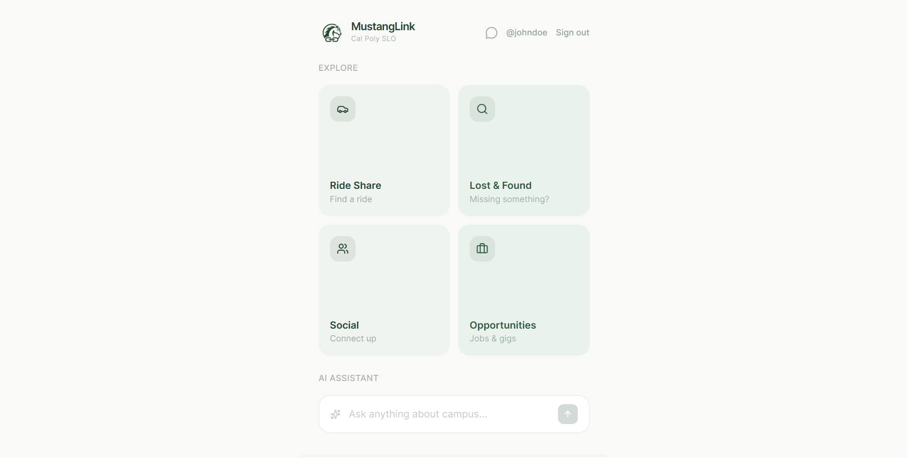

# MustangLink 🐴



**An AI-powered campus community platform built in 14 hours at KiroHacks @ Cal Poly SLO.**

MustangLink helps Cal Poly students navigate campus life through intelligent community hubs and an AI chatbot that understands the Cal Poly ecosystem in real time. Built under pressure, shipped with purpose.

---

## What It Does

MustangLink connects students through four community hubs:

- **Rideshare** — Coordinate rides to and from SLO
- **Lost & Found** — Report and recover lost items on and off campus
- **Opportunities** — Discover jobs, internships, and campus events
- **Social** — Ask questions, start discussions, connect with peers

Access is restricted to users with a **Cal Poly email**, keeping the platform student-only.

---

## Key Features

- **AI Chatbot powered by Groq** — Answers student questions using real-time platform data. Ask "Did anyone find a blue pencil case?" and the AI surfaces the relevant Lost & Found post instantly.
- **Developer-injectable context** — The team can continuously feed Cal Poly-specific data to the AI, improving its contextual understanding over time.
- **Rich posting** — Text and image posts with threaded replies.
- **Report system** — Posts with 3+ reports are automatically hidden from the feed.
- **Cal Poly email authentication** — Verified student-only access.

---

## Tech Stack

| Layer | Technology |
|---|---|
| AI | Groq API (Llama 3) |
| Frontend | React + Vite + Tailwind CSS |
| Database | Supabase (PostgreSQL) |
| Deployment | Vercel |
| Version Control | Git |

---

## Running Locally

**Prerequisites:** Node.js

1. Clone the repo:
   ```bash
   git clone https://github.com/lagoo0n/mustanglink.git
   cd mustanglink
   ```

2. Install dependencies:
   ```bash
   npm install
   ```

3. Copy `.env.example` to `.env` and fill in your keys:
   ```
   VITE_SUPABASE_URL=your_supabase_url
   VITE_SUPABASE_ANON_KEY=your_supabase_anon_key
   VITE_GROQ_API_KEY=your_groq_api_key
   ```

4. Start the development server:
   ```bash
   npm run dev
   ```

---

## Deployment

Live deployment is handled via **Vercel**. Push to `main` to trigger a production build.

---

## The Story

MustangLink was built in **14 hours** at **KiroHacks**, a hackathon hosted at Cal Poly San Luis Obispo. The goal was to solve a real problem for real students — fragmented campus resources, no central place to coordinate rideshares, find lost items, or surface opportunities.

The project capstone is the **AI-driven contextual search system**: Groq analyzes live posts and platform activity to give students intelligent, up-to-the-minute answers rather than static search results.

This project deepened hands-on experience in fast-paced product development, AI integration, and building scalable community applications under tight time constraints.

---

## Team

Built with ❤️ by:
- [Ethan Ikenaga](https://github.com/ethanikenaga)
- [Daniel Huang](https://github.com/boodrift1)
- [Peter Lin](https://github.com/pLin13cp)
- [Logan Chook](https://github.com/lagoo0n)

Special thanks to **Toptal** and **Kiro** for hosting KiroHacks, enjoy!
